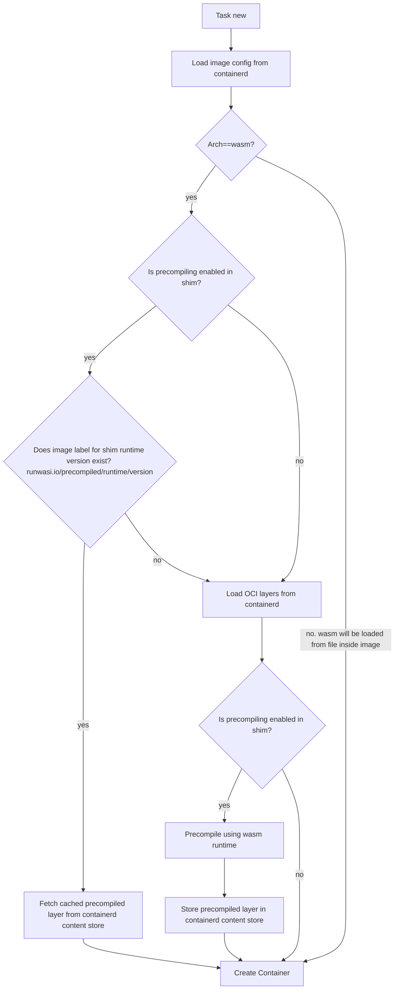

# OCI pre-compilation

The OCI images layers are loaded from containerd.  If the runtime supports pre-compilation the images will be precompiled and cached using the containerd content store.  



Once a wasm module or component is pre-compiled it will remain in the containerd content store until the original image is removed from containerd.  There is a small disk overhead associated with this but it reduces the complexity of managing stored versions during upgrades.

To view the images in containerd that have associated pre-compilations:

```bash
sudo ctr i ls | grep "runwasi.io"
ghcr.io/containerd/runwasi/wasi-demo-oci:latest                                                             application/vnd.oci.image.manifest.v1+json
               sha256:60fccd77070dfeb682a1ebc742e9d677fc452b30a6b99188b081c968992394ce 2.4 MiB   wasi/wasm                                                                                                                           
runwasi.io/precompiled/wasmtime/0.3.1=sha256:b36753ab5a46f26f6bedb81b8a7b489cede8fc7386f1398706782e225fd0a98e

# query for the sha in the label
sudo ctr content ls | grep "b36753ab5a46f26f6bedb81b8a7b489cede8fc7386f139870"
sha256:60fccd77070dfeb682a1ebc742e9d677fc452b30a6b99188b081c968992394ce 561B    2 months        containerd.io/gc.ref.content.0=sha256:a3c18cd551d54d3cfbf67acc9e8f7ef5761e76827fe7c1ae163fca0193be88b3,containerd.io/gc.ref.content.config=sha256:85b7f2b562fe8665ec9d9e6d47ab0b24e2315627f5f558d298475c4038d71e8b,containerd.io/gc.ref.content.precompile=sha256:b36753ab5a46f26f6bedb81b8a7b489cede8fc7386f1398706782e225fd0a98e
sha256:b36753ab5a46f26f6bedb81b8a7b489cede8fc7386f1398706782e225fd0a98e 626.4kB 3 days          runwasi.io/precompiled=sha256:60fccd77070dfeb682a1ebc742e9d677fc452b30a6b99188b081c968992394ce
```