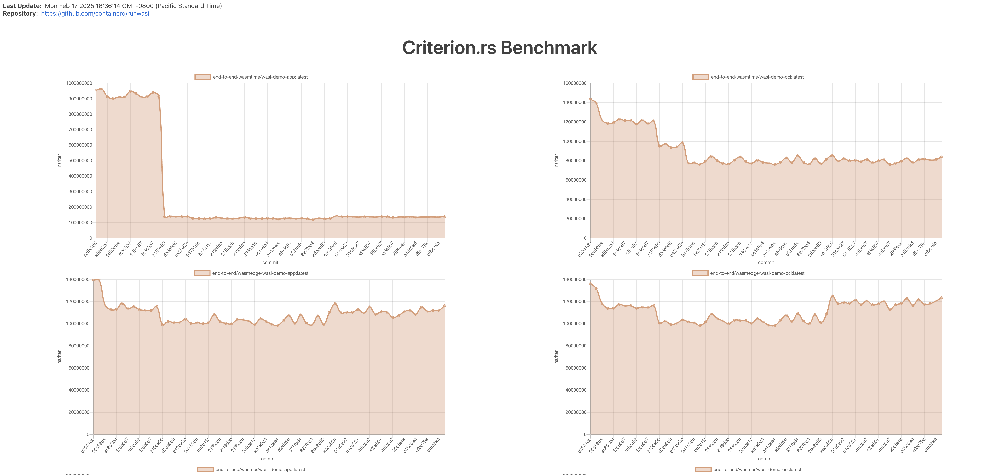

# Runwasi Benchmarks

## Overview

This document outlines the various methods and ideas for benchmarking `runwasi` shims. The goal is to provide a structured approach to measuring the performance of the `runwasi` shims and comparing it against other container runtimes, such as `runc` or `crun`. These benchmarks will help track performance changes across different versions and explore how well `runwasi` scales in high-density environments.

## Benchmarking Goals

1. Establish a baseline performance for `runwasi` shims
1. Measure the impact of changes to the source code and version upgrades on performance
1. Test the density of `runwasi` shims in a single node.
1. Visualize the performance data over time.
1. Identify areas for further optimizations

## Approaches

### 1. Baseline Performance

To establish a baseline performance, we use the "ghcr.io/containerd/runwasi/wasi-demo-app:latest" and "ghcr.io/containerd/runwasi/wasi-demo-oci:latest" images. These images are simple demo apps that echoes `"hello"` to the console using WASI. We run end-to-end benchmarks for `wasmtime`, `wasmedge`, `wasmer` and `wamr` runtimes and measure the execution duration. The result can be found in [dev/bench](https://runwasi.dev/dev/bench) website, under the "Criterion.rs Benchmark" section.

The source code for the benchmarks can be found in [benchs/containerd-shim-benchmarks](https://github.com/containerd/runwasi/tree/containerd-shim-wasm/v0.9.0/benches/containerd-shim-benchmarks) directory.

### 2. Stress Test

[stress-test](https://github.com/containerd/runwasi/tree/containerd-shim-wasm/v0.9.0/crates/stress-test) is a CLI that runs a stress test for the `runwasi` shims. It allows us to deploy a large number of Wasm-based tasks to evaluate task throughput (number of tasks finished per second) under high-density environments. The stress test supports running workloads with mocked containerd server and a real containerd server and supports running `N` tasks in total with `M` concurrent tasks. The result can be found in [dev/bench](https://runwasi.dev/dev/bench) website, under the "Stress Test Benchmark" section.

### 3. Memory

We've added functions to collect memory usage data from the shim and zygote processes. We use `scripts/benchmark-mem.sh` script to collect the data. The result can be found in[dev/bench](https://runwasi.dev/dev/bench) website, under the "Criterion.rs Benchmark" section.

### 4. Networking

This is for Wasmtime shim. We use `hey` to load test the Wasmtime shim running "ghcr.io/containerd/runwasi/wasi-demo-http:latest" workload. We measure the HTTP throughput and latency of the workload. The result can be found in [dev/bench](https://runwasi.dev/dev/bench) website, under the "HTTP Throughput" and "HTTP Latency" sections.

### 5. Runwasi vs. Native Execution

We built a distroless container image with `wasmtime` runtime installed. Then we run stress-test for `wasmtime` shim and the distroless container for the same workload. The result is shown below.

| Runtime | Tasks | Time | Throughput |
|---------|-------|------|------------|
| runwasi wasmtime | 1000 | 3s 31ms 663us 672ns | 329.85 tasks/s |
| runc distroless wasmtime | 1000 | 11s 795ms 27us 285ns | 84.78 tasks/s |


The Dockerfile for the distroless container is shown below.

```Dockerfile
# syntax=docker/dockerfile:1.13-labs
FROM rust AS build-base
RUN rustup target add x86_64-unknown-linux-musl
RUN apt-get update -y && apt-get install musl-tools -y

FROM build-base AS wasmtime-build
RUN cargo install \
    --target='x86_64-unknown-linux-musl' \
    --profile='fastest-runtime' \
    --config='profile.fastest-runtime.strip="symbols"' \
    --config='profile.fastest-runtime.panic="abort"' \
    wasmtime-cli
RUN cp $(which wasmtime) /wasmtime

FROM scratch AS wasmtime
COPY --from=wasmtime-build /wasmtime /

FROM build-base AS wasm-tools
RUN cargo install wasm-tools

FROM wasm-tools AS build
COPY hello.wat /
RUN wasm-tools parse </hello.wat >/hello.wasm

FROM wasmtime AS final
COPY --from=build /hello.wasm /
ENTRYPOINT ["/wasmtime", "/hello.wasm"]
```

### 6. Visualize the Performance Data

We use [benchmark-action](https://github.com/benchmark-action/github-action-benchmark) to visualize the performance data and we have a benchmark CI job that runs every day at midnight UTC. It will aggregate the result from the daily benchmark and visualize it in a chart. Any regression detected will be notifying to the runwasi-committers group. The result can be found in [dev/bench](https://runwasi.dev/dev/bench) website.



### Contributing to the Benchmarks

If you want to contribute to the benchmarks, whether it's adding a new benchmark or improving the existing ones, or just want to share your ideas, please refer to the following issue:

- [Benchmarking issue #97](https://github.com/containerd/runwasi/issues/97)

Any PRs are welcome!
